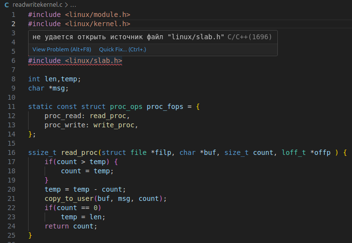
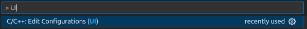
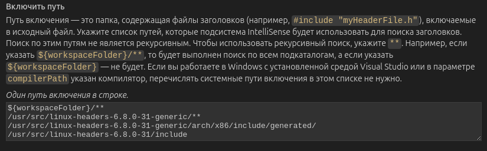
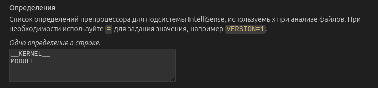
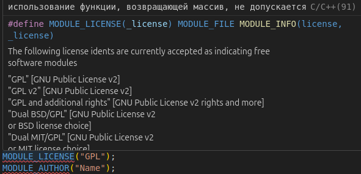
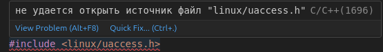
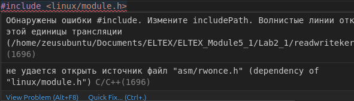

# Гайд по настройке окружения VScode для 5 модуля курса ELTEX

Вот Вы открыли VScode, вставили программу и видите следующее:



Это происходит из того, что у Вас не настроены пути по умолчанию для incudePath

---

## Вот что Вам нужно сделать


В открытом VScode нажимаем *ctrl+shift+P* и в появившейся строке вводим *"UI"* и открываем настройки



Здесь нам нужно сделать следующее:

Добавить в поле следующую информацию *(понятно дело, если у Вас другая версия ядра не забудьте поменять linux-headers-<номер ядра>)*



```
${workspaceFolder}/**
/usr/src/linux-headers-6.8.0-31-generic/**
/usr/src/linux-headers-6.8.0-31-generic/arch/x86/include/generated/
/usr/src/linux-headers-6.8.0-31/include
```

   Это делается для обнаружения всех header-файлов используемых для данной программы [ссылка](https://pastebin.com/EfaYWKNL) (*  \*\* - рекурсивный поиск в указанной папке *) 

А так же добавить добавить следующие определения:



```
__KERNEL__
MODULE
```

Это делается, чтобы не ругались следующие макросы:



#### Итоговый c_cpp_properties.json выглядит так

```json
{
    "configurations": [
        {
            "name": "linux-gcc-x64",
            "includePath": [
                "${workspaceFolder}/**",
                "/usr/src/linux-headers-6.8.0-31-generic/**",
                "/usr/src/linux-headers-6.8.0-31-generic/arch/x86/include/generated/",
                "/usr/src/linux-headers-6.8.0-31/include"
            ],
            "compilerPath": "/usr/bin/gcc",
            "cStandard": "${default}",
            "cppStandard": "${default}",
            "intelliSenseMode": "linux-gcc-x64",
            "compilerArgs": [
                ""
            ],
            "defines": [
                "__KERNEL__",
                "MODULE"
            ]
        }
    ],
    "version": 4
}
```

## Как я искал директории 

Понятно дело, скорей всего пути, которые я описал выше, не покроют все файлы, которые могут понадобится, поэтому расскажу как я искал данные зависимости

Смотрим на что ругается



Скорей всего нам просто неизвестен путь до этого файла, поэтому отыщем этот файл
```bash
zeusubuntu@zeusubuntu:~$ sudo find / -name slab.h -type f | grep linux/slab.h
/usr/src/linux-headers-6.8.0-31/include/linux/slab.h
```

Добавим директорию */usr/src/linux-headers-6.8.0-31/include/* в includePath

linux/uaccess.h теперь определяется и его даже можно посмотреть при помощи F12 (или ctrl+ЛКМ), но теперь у нас появились новые ошибки



Как видим проблемы с *asm/rwonce.h* пробуем его найти
```bash
zeusubuntu@zeusubuntu:~$ sudo find / -name rwonce.h -type f | grep asm/rwonce.h
/usr/src/linux-headers-6.8.0-31/arch/s390/include/asm/rwonce.h
/usr/src/linux-headers-6.8.0-31/arch/arm64/include/asm/rwonce.h
/usr/src/linux-headers-6.8.0-31/arch/alpha/include/asm/rwonce.h
/usr/src/linux-headers-6.8.0-31-generic/arch/x86/include/generated/asm/rwonce.h
```

В этот раз у нас получилось несколько директорий. Наверно можно каждую добавить, но наверно лучше взять только *usr/src/linux-headers-6.8.0-31-generic/arch/x86/include/generated/asm/rwonce.h*


